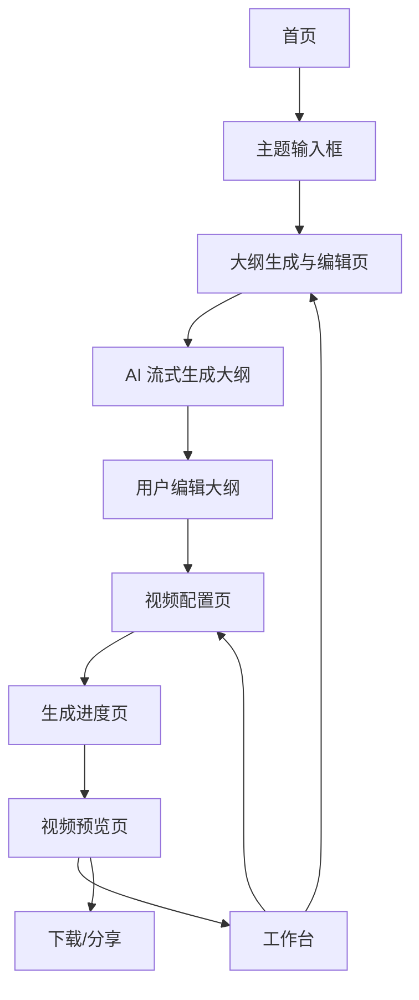

# MindMap Video 产品需求文档

## 1. 产品概述

MindMap Video 是一个 AI 驱动的思维导图视频生成 Web 平台，用户输入主题后由 AI 自动生成结构化大纲，确认修改后一键生成动画视频。
产品旨在为内容创作者、教育工作者和知识分享者提供极简的视频制作工具，将传统视频制作流程从数小时压缩到分钟级，目标市场为知识科普、在线教育、企业培训等场景。

## 2. 核心功能

### 2.1 用户角色

| 角色 | 接入方式 | 核心权限 |
|------|---------|---------|
| 默认 admin 用户 | 系统内置，无需登录注册 | 完整使用大纲生成、视频生成、项目管理，所有功能无限制 |

> **说明**：当前版本不提供登录/注册流程，所有访问者默认以内置 admin 用户身份进入系统，使用统一的本地数据空间。

### 2.2 功能模块

本产品由以下核心页面组成：

1. **首页（Landing）**：导航栏、核心卖点 Hero 区、主题输入框、流程展示、案例展示、页脚。
2. **工作台（Dashboard）**：快捷主题输入、项目统计卡片、项目列表网格、空状态引导。
3. **大纲生成与编辑页**：步骤指示器、思维导图画布、节点编辑工具栏、AI 重新生成、确认进入下一步。
4. **视频配置页**：大纲只读预览、动画风格选择、视频参数设置、配音与主题样式、一键默认配置。
5. **生成进度页**：阶段指示器、进度条、剩余时间预估、返回工作台。
6. **视频预览页**：视频播放器、视频信息、下载分享操作、重新生成入口。
7. **用户中心**（简化版）：admin 用户资料展示、消息通知列表。

### 2.3 页面详情

| 页面名称 | 模块名称 | 功能描述 |
|---------|---------|---------|
| 首页 | 顶部导航栏 | Logo 展示、工作台入口、admin 头像（直接跳转用户中心），滚动时背景吸顶 |
| 首页 | Hero 主题输入区 | 大标题文案、副标题、主题输入框（带占位提示）、回车提交、热门主题快捷标签 |
| 首页 | 三步流程展示 | 图标 + 文案展示「输入主题 → 修改大纲 → 生成视频」三步流程，进入视图触发渐入动画 |
| 首页 | 案例展示 | 视频卡片网格，悬停自动播放预览 GIF，点击查看完整视频 |
| 首页 | 页脚 | 关于、联系方式、版权信息 |
| 工作台 | 快捷主题输入框 | 顶部固定输入框，提交后直接跳转大纲生成页（无需登录） |
| 工作台 | 项目统计 | 展示总项目数、已完成视频数、生成中任务数（基于本地数据） |
| 工作台 | 项目卡片网格 | 缩略图、标题、状态标签（草稿/生成中/已完成/失败）、操作按钮（查看/重新生成/删除） |
| 工作台 | 空状态引导 | 无项目时展示插画 + 输入框，引导用户创建第一个项目 |
| 大纲生成与编辑页 | 步骤指示器 | 四步进度条（输入/编辑/配置/生成），当前步骤高亮，已完成步骤可回退 |
| 大纲生成与编辑页 | 思维导图画布 | AI 流式生成节点，自动布局，支持缩放/平移，节点逐个淡入 |
| 大纲生成与编辑页 | 节点编辑工具 | 双击编辑、添加子/兄弟节点、删除、拖拽排序、撤销/重做、节点备注 |
| 大纲生成与编辑页 | 操作栏 | 重新生成、节点统计、预估视频时长、确认进入下一步按钮 |
| 视频配置页 | 大纲预览 | 左侧只读思维导图小图，节点选中时联动右侧配置项 |
| 视频配置页 | 动画风格选择 | 四种风格卡片（逐级展开/路径漫游/聚焦放大/全局总览），悬停展示 GIF 预览 |
| 视频配置页 | 视频参数 | 分辨率、画面比例、节点停留时长下拉选择，实时显示预估总时长 |
| 视频配置页 | 配音设置 | 音色卡片选择、试听按钮、语速滑块、背景音乐下拉、静音开关 |
| 视频配置页 | 主题样式 | 视觉主题缩略图选择（简约/科技/学术/卡通/商务） |
| 视频配置页 | 提交栏 | 一键默认配置按钮、生成视频提交按钮、预估时长与文件大小信息 |
| 生成进度页 | 阶段指示器 | 四阶段（语音生成/动画渲染/视频合成/完成），完成阶段打勾，进行中显示 spinner |
| 生成进度页 | 进度条 | 百分比进度条、剩余时间预估、温馨提示文案 |
| 生成进度页 | 后台运行提示 | 「可以离开页面，完成后会通知你」提示 + 返回工作台按钮 |
| 视频预览页 | 视频播放器 | 内嵌播放器、播放进度、音量、全屏、画中画 |
| 视频预览页 | 视频信息 | 标题、分辨率、时长、文件大小标签 |
| 视频预览页 | 操作按钮 | 下载视频、重新生成、生成分享链接、保存项目 |
| 用户中心 | 个人资料 | 展示内置 admin 用户名「Admin」、头像、简介（只读） |
| 用户中心 | 消息通知 | 系统消息、视频生成完成通知列表 |

## 3. 核心流程

**默认 admin 主流程**：用户访问首页 → 在主题输入框输入感兴趣的主题（如"人工智能发展史"）→ 点击生成 → 直接进入大纲生成与编辑页（默认 admin 身份，无需登录），AI 流式生成思维导图 → 用户审核并修改节点（增删改拖拽）→ 点击确认大纲 → 进入视频配置页，选择动画风格、分辨率、配音、主题等 → 点击生成视频 → 跳转生成进度页，展示实时进度 → 完成后进入视频预览页 → 下载、分享或保存到工作台。

## 4. 用户界面设计

### 4.1 设计风格

- **主色调**：深墨蓝 `#0B1A2A`（背景）+ 电光青 `#7CFFCB`（主强调色），辅以暖橙 `#FF8A4C`（次强调色）
- **辅助色**：石墨灰 `#1F2A37`（卡片）、月光白 `#F5F7FA`（前景文字）、雾灰 `#9CA3AF`（次要文字）
- **按钮风格**：主按钮为锐利直角 + 1px 描边 + hover 发光辉光（box-shadow），次按钮为透明 + 描边
- **字体**：标题使用 `"Space Grotesk", "Noto Serif SC"` 兼具几何与中文衬线美感（替代 Inter 等通用字体），正文使用 `"IBM Plex Sans", "PingFang SC"`，代码使用 `"JetBrains Mono"`
- **字号体系**：H1 56px / H2 40px / H3 28px / 正文 16px / 辅助 14px
- **布局风格**：卡片化 + 顶部固定导航 + 大量负空间，关键页面采用左右分栏（编辑/配置）；编辑器画布占据视觉中心
- **图标风格**：Lucide 线性图标 + 少量自定义几何 emoji（💡📝🎬）；保持 1.5px 描边一致性
- **动效**：使用 `@vueuse/motion` 实现页面过渡 + 节点流式渐入；按钮 hover 微缩放 1.02；步骤切换横向滑入

### 4.2 页面设计概览

| 页面名称 | 模块名称 | UI 元素 |
|---------|---------|---------|
| 首页 | Hero 主题输入区 | 全屏深色背景 + 渐变光晕 + 居中大标题（Space Grotesk 64px）+ 大型圆角输入框（高 64px，发光描边）+ 热门标签芯片 |
| 首页 | 三步流程 | 三栏卡片，每卡片含大号 emoji + 标题 + 副文案 + 装饰连接箭头，进入视图时 staggered 依次淡入 |
| 首页 | 案例展示 | 4 列卡片网格，圆角 16px，悬停时缩放 1.03 + 阴影加深 + 自动播放 GIF |
| 工作台 | 项目卡片 | 1.6:1 缩略图 + 状态徽章（圆点 + 文字）+ 标题截断 + 时间戳 + hover 悬浮工具按钮 |
| 大纲生成与编辑页 | 步骤指示器 | 顶部水平进度条，圆点 + 连线，完成态电光青色，未到达态雾灰色 |
| 大纲生成与编辑页 | 思维导图画布 | 全屏深色画布 + 暗色网格背景 + 节点为圆角矩形（不同层级不同色系），连线为贝塞尔曲线 |
| 视频配置页 | 动画风格选择 | 2x2 卡片网格，每卡片含动效预览 + 单选标识，选中时电光青色边框发光 |
| 视频配置页 | 配音音色 | 横向滚动音色卡片，含头像 + 名称 + 试听按钮 |
| 生成进度页 | 阶段指示器 | 居中四阶段流程图，进行中阶段含旋转 spinner + 脉动光环 |
| 视频预览页 | 视频播放器 | 16:9 居中黑色播放器，自定义控件，环绕渐变光晕 |

### 4.3 响应式设计

桌面优先（≥1280px 完整双栏布局），平板端（768-1279px）将编辑/配置页的双栏改为可折叠面板堆叠，移动端（<768px）大纲编辑器降级为列表式大纲视图（保留增删改），视频预览与播放完整支持移动端，触摸操作做拖拽手势优化。
