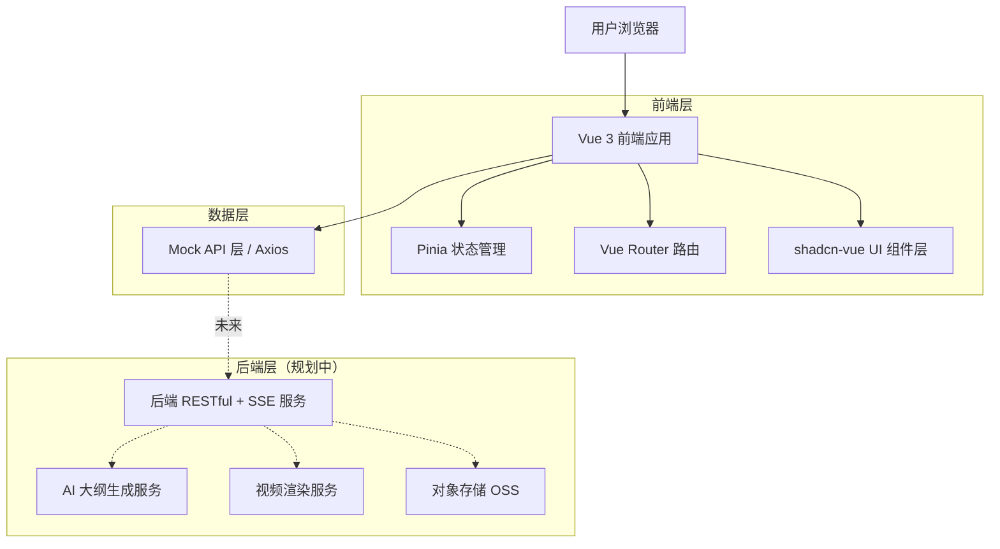
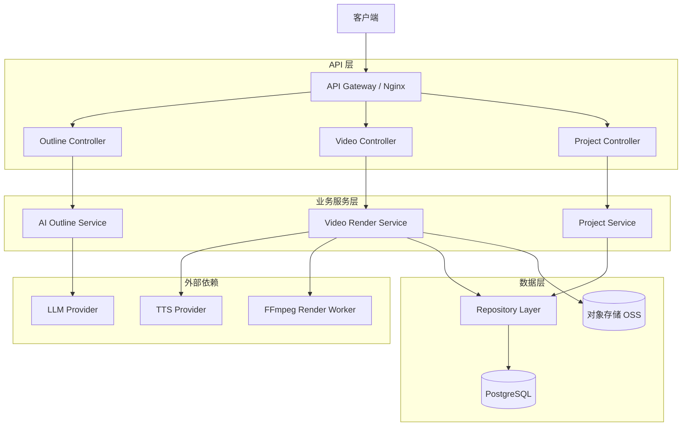
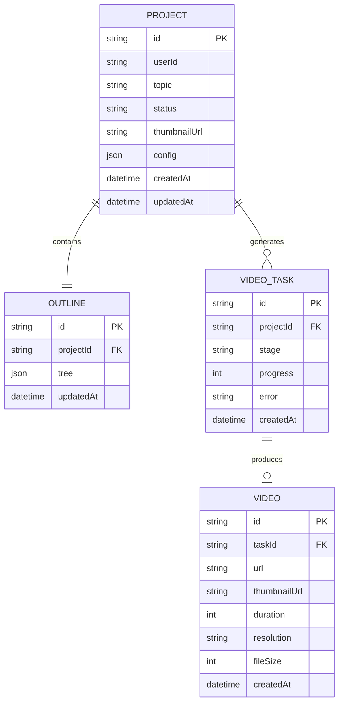

# MindMap Video 技术架构文档

## 1. 架构设计



## 2. 技术描述

- **前端框架**：Vue@3.4 + Vite@5（使用 `<script setup>` 组合式 API）
- **语言**：TypeScript@5
- **路由**：Vue Router@4（History 模式）
- **状态管理**：Pinia@2（持久化插件 pinia-plugin-persistedstate）
- **UI 组件库**：shadcn-vue（基于 reka-ui，复制源码到本地项目）+ Tailwind CSS@3
- **样式工具**：tailwindcss、tailwindcss-animate、class-variance-authority、tailwind-merge、clsx
- **图标库**：lucide-vue-next
- **思维导图渲染**：vue-flow@1（基于 @vue-flow/core、@vue-flow/background、@vue-flow/controls，节点采用自定义组件）
- **动画**：@vueuse/motion + tailwindcss-animate
- **HTTP 请求**：axios + @tanstack/vue-query（请求缓存 + 状态管理）
- **AI 流式接收**：原生 EventSource（SSE） + 封装 composable
- **表单校验**：vee-validate + zod
- **工具集**：@vueuse/core、date-fns、nanoid
- **后端**：MVP 阶段使用 Mock Service Worker（msw）模拟接口，后续接入真实后端
- **数据库**：MVP 阶段使用浏览器 LocalStorage 持久化用户项目（通过 Pinia 持久化），后续接入真实后端数据库
- **包管理器**：pnpm
- **代码规范**：ESLint + Prettier + Vue 官方规则集

## 3. 路由定义

> 系统不提供登录注册流程，所有路由均直接可访问，用户身份默认为内置 admin。

| 路由路径 | 用途 |
|---------|------|
| `/` | 首页（Landing），核心卖点 + 主题输入入口 |
| `/dashboard` | 工作台，项目列表与快捷入口 |
| `/outline/:projectId?` | 大纲生成与编辑页，AI 流式生成 + 思维导图编辑 |
| `/config/:projectId` | 视频配置页，选择动画风格、分辨率、配音、主题 |
| `/progress/:taskId` | 生成进度页，展示后端任务实时进度 |
| `/preview/:videoId` | 视频预览页，播放、下载、分享 |
| `/profile` | 用户中心（admin 资料展示 + 消息通知） |
| `/:pathMatch(.*)*` | 404 页面 |

## 4. API 定义

> MVP 阶段所有接口由 msw 在前端拦截并返回模拟数据，接口契约保持与未来真实后端一致。
> 当前版本不提供登录注册接口，前端启动时自动注入内置 admin 用户上下文（写入 Pinia + LocalStorage）。

### 4.1 当前用户

```typescript
// GET /api/me
// 始终返回内置 admin 用户信息
interface CurrentUser {
  id: 'admin'
  nickname: 'Admin'
  avatarUrl: string
  role: 'admin'
}
```

### 4.2 大纲生成

```typescript
// POST /api/outline/generate (Server-Sent Events)
interface OutlineGenerateRequest {
  topic: string
  depth?: 2 | 3 | 4
  audience?: 'beginner' | 'intermediate' | 'professional'
  style?: 'popular' | 'academic' | 'casual' | 'business'
}

// SSE event 数据格式
interface OutlineStreamEvent {
  type: 'node' | 'done' | 'error'
  payload?: {
    id: string
    parentId: string | null
    title: string
    depth: number
  }
  message?: string
}

// POST /api/outline/save
interface OutlineSaveRequest {
  projectId?: string
  topic: string
  tree: OutlineNode
}
interface OutlineNode {
  id: string
  title: string
  note?: string
  children?: OutlineNode[]
}
```

### 4.3 视频生成

```typescript
// POST /api/video/generate
interface VideoGenerateRequest {
  projectId: string
  outline: OutlineNode
  config: VideoConfig
}
interface VideoConfig {
  animationStyle: 'unfold' | 'roam' | 'focus' | 'overview'
  resolution: '720p' | '1080p' | '2k' | '4k'
  ratio: '16:9' | '9:16' | '1:1'
  nodeDuration: number
  voice: { id: string; speed: number; volume: number } | null
  bgm: { id: string; volume: number } | null
  theme: 'minimal' | 'tech' | 'academic' | 'cartoon' | 'business'
}
interface VideoGenerateResponse {
  taskId: string
  estimatedDuration: number
}

// GET /api/video/progress/:taskId (Server-Sent Events)
interface VideoProgressEvent {
  stage: 'voice' | 'animation' | 'compose' | 'done' | 'failed'
  progress: number
  remainingSeconds?: number
  videoId?: string
  error?: string
}

// GET /api/video/:videoId
interface VideoDetail {
  id: string
  projectId: string
  url: string
  thumbnailUrl: string
  duration: number
  resolution: string
  fileSize: number
  createdAt: string
}
```

### 4.4 项目管理

```typescript
// GET /api/projects?status=&keyword=&page=
interface ProjectListItem {
  id: string
  topic: string
  thumbnailUrl: string
  status: 'draft' | 'generating' | 'completed' | 'failed'
  videoId?: string
  updatedAt: string
}

// DELETE /api/projects/:id
// GET /api/projects/:id => Project (含 outline 和 config)
```

## 5. 服务器架构图（规划中）



## 6. 数据模型

### 6.1 数据模型定义

> 当前版本不存储多用户数据，所有项目均归属内置 admin 用户。模型中保留 `userId` 字段（值固定为 `'admin'`），便于未来多用户能力扩展。



### 6.2 数据定义语言

```sql
-- 项目表（user_id 固定为 'admin'，保留字段以备未来多用户扩展）
CREATE TABLE projects (
    id VARCHAR(32) PRIMARY KEY,
    user_id VARCHAR(32) NOT NULL DEFAULT 'admin',
    topic VARCHAR(255) NOT NULL,
    status VARCHAR(20) NOT NULL DEFAULT 'draft',
    thumbnail_url VARCHAR(255),
    config JSONB,
    created_at TIMESTAMP NOT NULL DEFAULT CURRENT_TIMESTAMP,
    updated_at TIMESTAMP NOT NULL DEFAULT CURRENT_TIMESTAMP
);
CREATE INDEX idx_projects_status ON projects(status);
CREATE INDEX idx_projects_updated_at ON projects(updated_at DESC);

-- 大纲表
CREATE TABLE outlines (
    id VARCHAR(32) PRIMARY KEY,
    project_id VARCHAR(32) UNIQUE NOT NULL,
    tree JSONB NOT NULL,
    updated_at TIMESTAMP NOT NULL DEFAULT CURRENT_TIMESTAMP,
    FOREIGN KEY (project_id) REFERENCES projects(id) ON DELETE CASCADE
);

-- 视频任务表
CREATE TABLE video_tasks (
    id VARCHAR(32) PRIMARY KEY,
    project_id VARCHAR(32) NOT NULL,
    stage VARCHAR(20) NOT NULL DEFAULT 'voice',
    progress INT NOT NULL DEFAULT 0,
    error TEXT,
    created_at TIMESTAMP NOT NULL DEFAULT CURRENT_TIMESTAMP,
    FOREIGN KEY (project_id) REFERENCES projects(id) ON DELETE CASCADE
);
CREATE INDEX idx_video_tasks_project ON video_tasks(project_id);

-- 视频表
CREATE TABLE videos (
    id VARCHAR(32) PRIMARY KEY,
    task_id VARCHAR(32) NOT NULL,
    url VARCHAR(255) NOT NULL,
    thumbnail_url VARCHAR(255),
    duration INT,
    resolution VARCHAR(10),
    file_size BIGINT,
    created_at TIMESTAMP NOT NULL DEFAULT CURRENT_TIMESTAMP,
    FOREIGN KEY (task_id) REFERENCES video_tasks(id)
);

-- 初始化演示数据
INSERT INTO projects (id, topic, status)
VALUES
    ('proj-01', '人工智能发展史', 'completed'),
    ('proj-02', 'Python 入门学习路线', 'draft'),
    ('proj-03', '区块链原理', 'generating');
```
